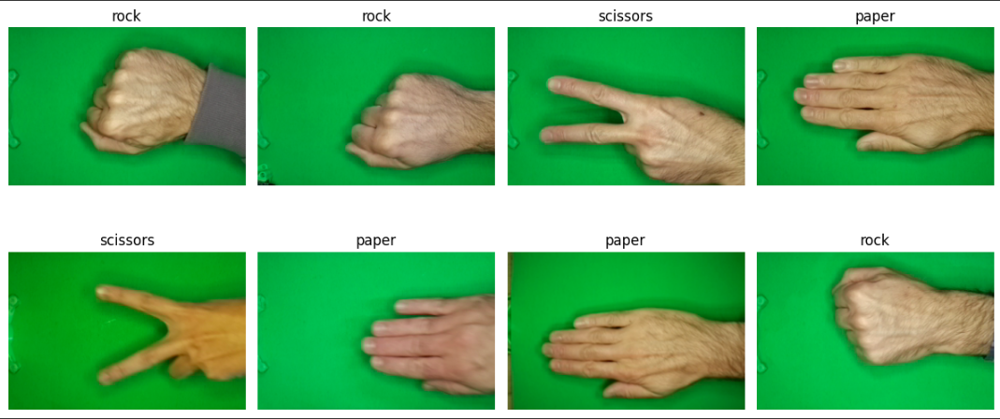
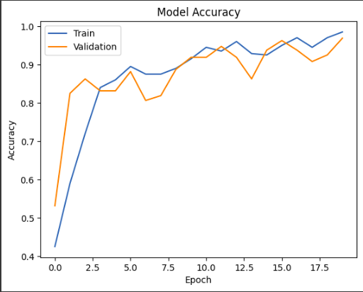

# 🖐️✊✌️ Rock Paper Scissors Image Classifier



## 🚀 Project Overview

This project implements a deep learning model to classify images of hand gestures into Rock, Paper, or Scissors categories. It's an excellent demonstration of applying Convolutional Neural Networks (CNNs) to solve a real-world image classification problem.

Created by: Krisna Santosa  
Dicoding Username: [krisna_santosa](https://www.dicoding.com/users/krisna_santosa/)


you can access the notebook [here](notebook.ipynb)
## 🎯 Key Features

- Data preprocessing and augmentation
- Custom CNN architecture
- Experiment with various optimizers
- Model checkpointing
- Learning rate scheduling
- Performance visualization
- Confusion matrix analysis
- Real-time prediction on user-uploaded images

## 🛠️ Technologies Used

- TensorFlow and Keras
- NumPy
- Matplotlib and Seaborn
- Scikit-learn
- PIL (Python Imaging Library)

## 📊 Model Performance

Our best model achieved:
- Training Accuracy: 97%
- Validation Accuracy: 95%



## 🧠 Model Architecture

```
_________________________________________________________________
Layer (type)                 Output Shape              Param #   
=================================================================
conv2d (Conv2D)              (None, 148, 148, 32)      896       
_________________________________________________________________
max_pooling2d (MaxPooling2D) (None, 74, 74, 32)        0         
_________________________________________________________________
conv2d_1 (Conv2D)            (None, 72, 72, 64)        18496     
_________________________________________________________________
max_pooling2d_1 (MaxPooling2 (None, 36, 36, 64)        0         
_________________________________________________________________
conv2d_2 (Conv2D)            (None, 34, 34, 128)       73856     
_________________________________________________________________
max_pooling2d_2 (MaxPooling2 (None, 17, 17, 128)       0         
_________________________________________________________________
conv2d_3 (Conv2D)            (None, 15, 15, 256)       295168    
_________________________________________________________________
max_pooling2d_3 (MaxPooling2 (None, 7, 7, 256)         0         
_________________________________________________________________
flatten (Flatten)            (None, 12544)             0         
_________________________________________________________________
dense (Dense)                (None, 512)               6423040   
_________________________________________________________________
dense_1 (Dense)              (None, 3)                 1539      
=================================================================
Total params: 6,812,995
Trainable params: 6,812,995
Non-trainable params: 0
_________________________________________________________________
```

## 🔍 Insights and Learnings

1. **Data Augmentation**: We applied various transformations like rotation, flipping, and shearing to increase the diversity of our training data and improve model generalization.

2. **Optimizer Comparison**: We experimented with different optimizers including Adam, Adagrad, RMSprop, SGD, and Nadam. Nadam performed the best with a learning rate of 0.001.

3. **Learning Rate Scheduling**: Implementing ReduceLROnPlateau helped in fine-tuning the model's performance by adjusting the learning rate during training.

4. **Model Complexity**: Adding an extra convolutional layer (256 filters) improved the model's ability to capture complex features in the images.

5. **Confusion Matrix Analysis**: The confusion matrix revealed that the model occasionally confuses 'Rock' with 'Scissors'. This insight can guide future improvements.

## 🚀 Getting Started

1. Clone the repository:
   ```
   git clone https://github.com/KrisnaSantosa15/rock-paper-scissors-classifier.git
   ```

2. Install dependencies:
   ```
   pip install -r requirements.txt
   ```

3. Run the Jupyter notebook to train the model and make predictions.

## 📈 Future Improvements

- Implement transfer learning using pre-trained models like VGG16 or ResNet
- Collect more diverse data to improve model generalization
- Explore ensemble methods to combine predictions from multiple models
- Deploy the model as a web application for real-time predictions

## 📚 Resources

- [TensorFlow Documentation](https://www.tensorflow.org/api_docs)
- [Keras Documentation](https://keras.io/api/)
- [Scikit-learn Documentation](https://scikit-learn.org/stable/documentation.html)
- [rock_paper_scissors Dataset](https://github.com/dicodingacademy/assets/releases/download/release/rockpaperscissors.zip)
## 🤝 Contributing

Contributions, issues, and feature requests are welcome! Feel free to check [issues page](https://github.com/KrisnaSantosa15/rock-paper-scissors-classifier/issues).

## 📄 License

This project is [MIT](LICENSE) licensed.

---

If you find this project interesting, don't forget to give it a star! ⭐

Best regards, <br>
Krisna Santosa